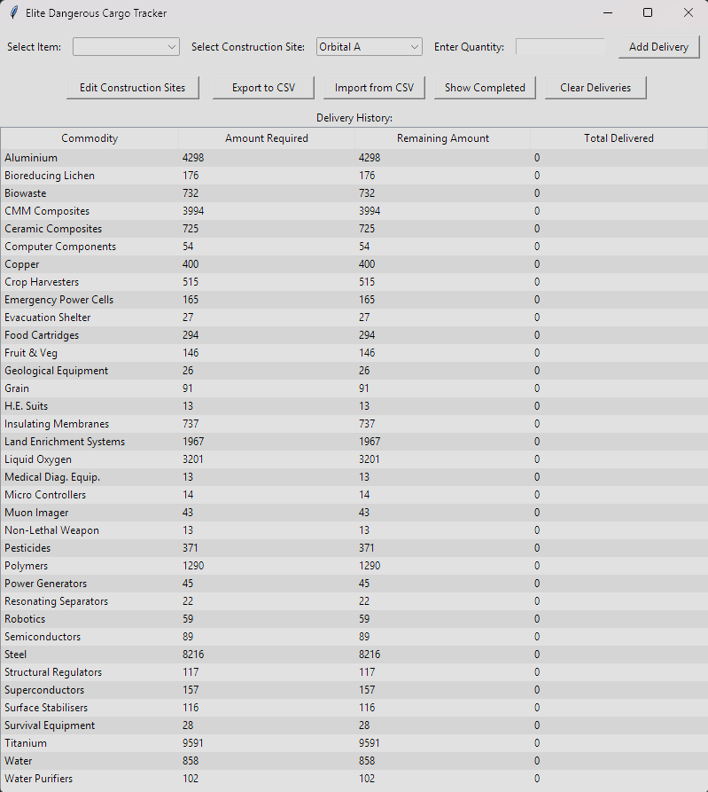

# EDColonyTracker

A cargo tracking application for Elite Dangerous colony construction projects. This tool helps commanders manage deliveries to construction sites by tracking commodity requirements and completed shipments.



## Features

- **Track Multiple Construction Sites**: Manage deliveries across multiple concurrent construction projects
- **Commodity Management**: Keep track of required commodities and delivered quantities
- **Progress Tracking**: Visual indicators show completion status of each required commodity
- **Import/Export**: Save and load data using CSV files
- **User-Friendly Interface**: Clean, intuitive GUI built with Tkinter

## Installation

### Requirements
- Python 3.7+
- Tkinter (usually included with Python)

### Setup

1. Clone this repository:
   ```bash
   git clone https://github.com/yourusername/EDColonyTracker.git
   cd EDColonyTracker
   ```

2. Run the application:
   ```bash
   python EDColonyTracker/main.py
   ```

## Usage

### Adding a Construction Site

1. Click "Edit Construction Sites"
2. Enter the name of the new site
3. Click "Add Construction Site"

### Recording Deliveries

1. Select a commodity from the dropdown menu
2. Select a construction site
3. Enter the quantity delivered
4. Click "Add Delivery"

### Viewing Progress

- The main table displays all deliveries with:
  - Commodity name
  - Amount required
  - Remaining amount needed
  - Total delivered
- Toggle "Show Completed" to view or hide completed deliveries

### Data Management

- **Export**: Save your data to a CSV file using the "Export to CSV" button
- **Import**: Load data from a CSV file using the "Import from CSV" button
- **Clear**: Remove all delivery records for a site with the "Clear Deliveries" button

### CSV Import Format

When importing data from CSV files, use the following structure:

- The CSV file should contain three columns: Commodity, Amount Required, and Construction Site
- The first row should be a header row with these column names
- Each subsequent row represents one commodity requirement for a specific construction site

Example CSV format:
```csv
Commodity,Amount Required,Construction Site
Titanium,4500,Maclaurin Reach
Computer Components,1800,Maclaurin Reach
Copper,2500,Fort Bradley
Emergency Power Cells,800,Fort Bradley
```

## Project Structure

```
EDColonyTracker/
├── databases/         # Database files
├── gui/
│   ├── __init__.py
│   ├── main_window.py
│   ├── delivery_ui.py
│   └── site_manager.py
├── images/            # Screenshots and UI previews
│   └── PreviewExample.png
├── database.py        # Database operations
├── main.py            # Application entry point
└── README.md
```

## Technologies Used

- **Python**: Core programming language
- **Tkinter**: GUI framework
- **SQLite3**: Local database storage

## Contributing

Contributions are welcome! Please feel free to submit a Pull Request.

1. Fork the project
2. Create your feature branch (`git checkout -b feature/amazing-feature`)
3. Commit your changes (`git commit -m 'Add some amazing feature'`)
4. Push to the branch (`git push origin feature/amazing-feature`)
5. Open a Pull Request

## License

This project is licensed under the MIT License - see the LICENSE file for details.

## Acknowledgments

- Elite Dangerous by Frontier Developments
- [EDCD: Community Developers Discord](https://discord.gg/zQjjutY)
- Claude 3.7 Sonnet and ChatGPT 4o AI models for code development assistance

---

*Fly safe, Commander! o7*
